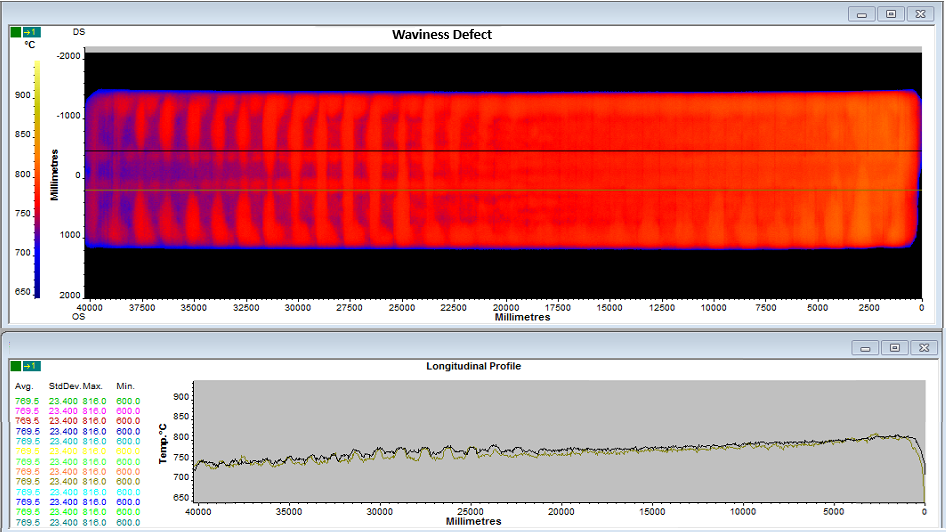
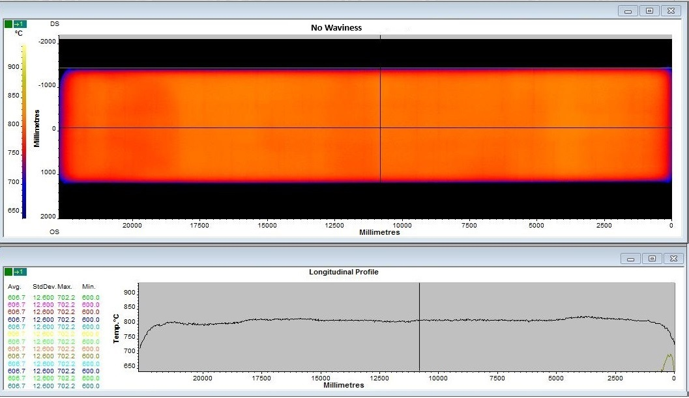
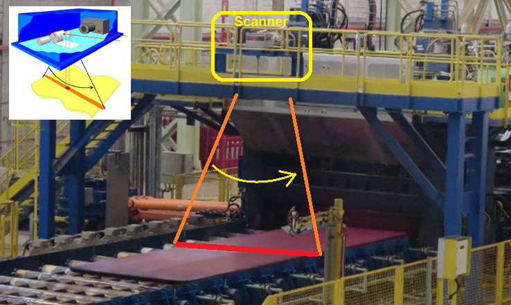
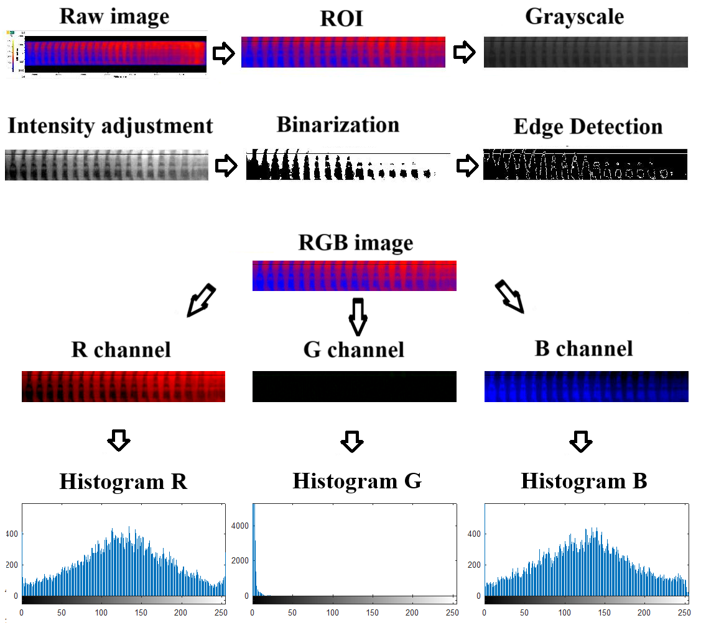
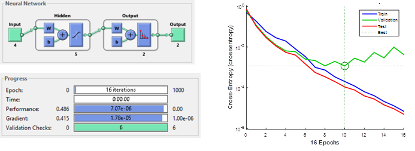

# Automatic-Steel-Defect-Detection

Automatic identification of waviness defects in hot-rolled steel sheets using artificial neural networks and image processing techniques.

## Project Overview
This project was developed as part of the **Bachelor's Degree in Mechatronics Engineering thesis**.

- **Title**: Identification of Waviness Defects in Hot-Rolled Steel Sheets in a Steel Mill Using Artificial Neural Networks and Image Processing
- **Author**: Guilherme Lopes Borges

The project focuses on the **automatic identification of waviness defects** in hot-rolled steel sheets using an image-based system to contribute to **industry digitalization** by automating defect detection processes.

## Demo

Example of plate with "Waviness Defect":


Example of plate with "No Waviness":


## Methodology

A methodology was developed that employs **digital image processing techniques** and **artificial neural networks** on a dataset of **4,700 images** (raw data) obtained directly from the production line of a steel mill. The system achieved an accuracy of **98.25%** in defect detection.

The system uses **artificial neural networks (ANNs)** and **computer vision** methodologies to detect and classify defects in real-time. The **image-based approach** automates manual inspection, reducing labor costs and increasing the speed and accuracy of defect identification.

### Data Acquisition



### Image Processing


### Network Training and Validation



## Key Features:
- **Image Processing**: Techniques like filtering, edge detection, and thresholding to preprocess the steel sheet images.
- **Artificial Neural Networks (ANNs)**: A trained model classifies steel sheets as 'Defective' or 'Non-Defective'.
- **Real-Time Detection**: Capable of processing images in real-time to identify defects as the sheets pass through the inspection system.

## Goals:
- Improve the speed and accuracy of detecting defects in steel production.
- Support the digitalization of industrial processes through automation.
- Reduce manual labor in quality control, minimizing the risk of human error.

## Installation

1. **Clone the repository**:
   ```bash
   git clone https://github.com/username/Automatic-Steel-Defect-Detection.git
   cd Automatic-Steel-Defect-Detection
